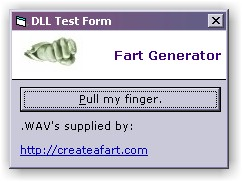



## Fart Generator Resource

### Description

Since I work with a bunch of men who are all a bunch of jokers I thought I would make this for them. The ZIP posted here has two projects; A DLL project and EXE project. When you open the Group project it will open both and you can review the code and try it out. The DLL is a Fart Resource DLL that has one class with two exposed methods. PlayFart(you pick the far) and RandomFart. I used this DLL and remotely installed it on my coworkers machines into their MTS(COM+ Applications) and then posted a ASP page onto each of their web servers. This allowed me to go to their webserver and fire off the RandomFart :) It was great hearing farts coming from down the hall and others in the office area actually thinking the person in the room was doing it.  :) :) :) Of course now they are going to get me back. Anyhow, thought I would share it here to incase any of you want to try it out.
 
### More Info
 

             |
---                |---
**Submitted On**   |2003-02-26 10:50:50
**By**             |[Chloe](https://github.com/Planet-Source-Code/PSCIndex/blob/master/ByAuthor/chloe.md)
**Level**          |Beginner
**User Rating**    |3.7 (11 globes from 3 users)
**Compatibility**  |VB 6\.0
**Category**       |[Jokes/ Humor](https://github.com/Planet-Source-Code/PSCIndex/blob/master/ByCategory/jokes-humor__1-40.md)
**World**          |[Visual Basic](https://github.com/Planet-Source-Code/PSCIndex/blob/master/ByWorld/visual-basic.md)
**Archive File**   |[Fart\_Gener1550852262003\.zip](https://github.com/Planet-Source-Code/chloe-fart-generator-resource__1-43572/archive/master.zip)

